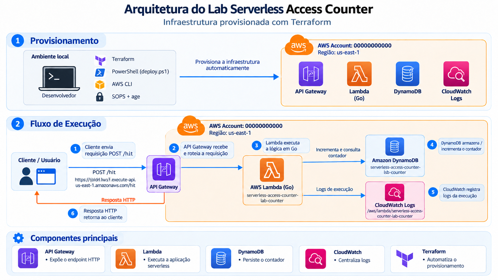
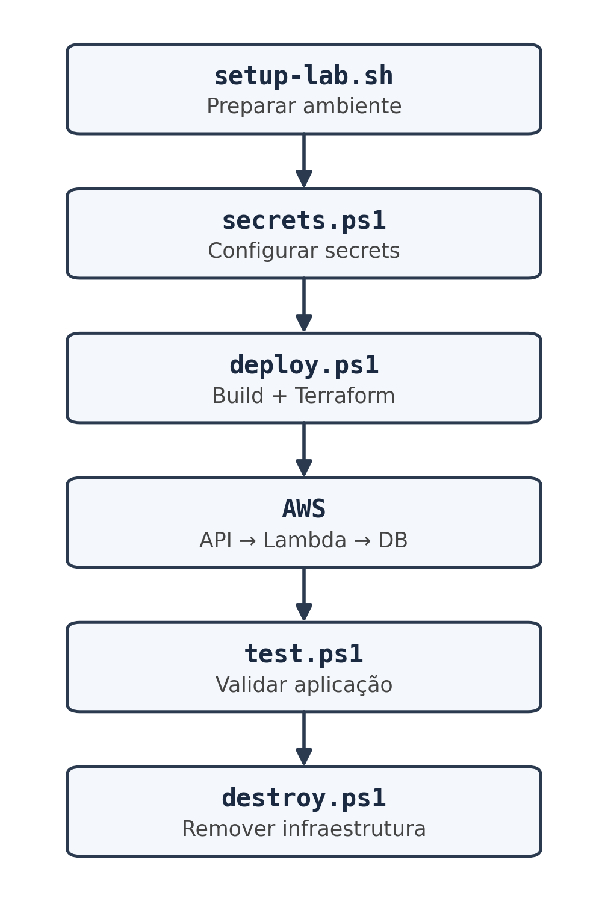

# AWS Serverless Access Counter

Laboratório de arquitetura serverless desenvolvido na AWS para implementar um
contador de acessos utilizando **API Gateway, AWS Lambda, DynamoDB e
CloudWatch**.

A aplicação recebe uma requisição `POST /hit`, incrementa atomicamente um
contador global armazenado no DynamoDB e retorna o valor atualizado.

O projeto foi desenvolvido originalmente a partir de uma atividade acadêmica
sobre arquitetura serverless e evoluído para demonstrar também práticas de:

- AWS Serverless;
- desenvolvimento em Go;
- Infrastructure as Code com Terraform;
- automação com PowerShell e Bash;
- gerenciamento seguro de credenciais;
- IAM Least Privilege;
- testes automatizados;
- validação de conta e região AWS;
- controle do ciclo de vida da infraestrutura;
- controle de custos.

---

## Arquitetura



### Visão geral

```text
Internet
   |
   v
API Gateway HTTP API
   |
   | POST /hit
   v
AWS Lambda
Go / ARM64
   |
   | UpdateItem
   v
Amazon DynamoDB
   |
   | PAY_PER_REQUEST
   v
Contador
```

A Lambda também envia seus logs para o Amazon CloudWatch.

```text
Lambda
   |
   v
CloudWatch Logs
```

A infraestrutura AWS é definida utilizando Terraform.

```text
Git
 |
 v
Terraform
 |
 +--> API Gateway
 +--> Lambda
 +--> DynamoDB
 +--> IAM
 +--> CloudWatch
```

---

# Objetivo

O cenário proposto para o laboratório é uma página de lançamento de produto
que precisa contabilizar seus acessos.

A quantidade de acessos pode variar, portanto a solução deve evitar a
necessidade de administrar servidores ou manter uma infraestrutura
dimensionada permanentemente.

A implementação utiliza serviços gerenciados da AWS para executar a aplicação
sob demanda e armazenar o estado do contador.

O endpoint principal é:

```text
POST /hit
```

Cada chamada incrementa o contador global.

Exemplo:

```json
{
  "hits": 1
}
```

Uma nova chamada:

```json
{
  "hits": 2
}
```

E assim sucessivamente.

---

# Fluxo da aplicação

O fluxo de execução da aplicação é simples:

```text
Cliente
   |
   | POST /hit
   v
API Gateway
   |
   | Invoca Lambda
   v
Lambda Go
   |
   | UpdateItem + ADD
   v
DynamoDB
   |
   | UPDATED_NEW
   v
Lambda
   |
   v
API Gateway
   |
   v
Cliente
```

O contador utiliza um único item lógico:

```text
id = "hits"
```

A atualização utiliza uma operação atômica do DynamoDB:

```text
ADD hits :increment
```

Não é necessário realizar uma leitura anterior para descobrir o valor atual.

O item é criado na primeira chamada e as chamadas seguintes incrementam o
valor existente.

---

# Decisão importante: incremento atômico

Uma implementação simples poderia seguir este fluxo:

```text
READ
  |
  v
incremento na aplicação
  |
  v
WRITE
```

Esse modelo possui uma janela de concorrência entre a leitura e a gravação.

Neste projeto, o incremento é realizado diretamente pelo DynamoDB:

```text
UpdateItem
    |
    +-- ADD hits :increment
    |
    +-- ReturnValues = UPDATED_NEW
```

Dessa forma, a aplicação não precisa realizar um ciclo de
leitura → alteração → gravação para cada acesso.

Essa foi uma das principais decisões técnicas da implementação.

---

# Componentes AWS

## API Gateway HTTP API

Responsável por disponibilizar o endpoint HTTP público:

```text
POST /hit
```

O API Gateway recebe a requisição e encaminha a execução para a Lambda.

Foi utilizado HTTP API porque atende ao objetivo do laboratório sem adicionar
recursos que não são necessários para o cenário.

---

## AWS Lambda

A lógica da aplicação é executada em uma função Lambda desenvolvida em Go.

Configuração:

```text
Runtime:       provided.al2023
Arquitetura:   ARM64
Memória:       128 MB
Timeout:       5 segundos
```

A função é compilada para:

```text
Linux / ARM64
```

A Lambda não mantém o contador localmente.

O estado da aplicação permanece no DynamoDB.

---

## Amazon DynamoDB

O DynamoDB armazena o contador global.

Chave de partição:

```text
id
```

Item utilizado:

```text
id = "hits"
```

A tabela utiliza:

```text
PAY_PER_REQUEST
```

Não existe capacidade provisionada fixa para a tabela.

---

## Amazon CloudWatch

Os logs da Lambda são enviados para o CloudWatch Logs.

O Log Group criado pelo Terraform possui retenção de:

```text
1 dia
```

A retenção curta foi escolhida para o laboratório para evitar armazenamento
desnecessário de logs.

---

## AWS IAM

A Lambda utiliza uma IAM Role específica.

A role possui apenas as permissões necessárias para:

```text
DynamoDB
    |
    +-- dynamodb:UpdateItem

CloudWatch Logs
    |
    +-- logs:CreateLogStream
    +-- logs:PutLogEvents
```

O acesso ao DynamoDB é restrito à tabela utilizada pelo projeto.

A aplicação não utiliza permissões administrativas.

---

# Infrastructure as Code

Toda a infraestrutura AWS é definida utilizando **Terraform**.

```text
terraform/
├── api_gateway.tf
├── cloudwatch.tf
├── dynamodb.tf
├── iam.tf
├── lambda.tf
├── locals.tf
├── outputs.tf
├── providers.tf
├── variables.tf
└── versions.tf
```

O Terraform é responsável por criar, alterar e destruir os recursos AWS.

Entre os recursos definidos estão:

```text
API Gateway
Lambda
DynamoDB
IAM Role
IAM Policy
CloudWatch Log Group
```

A infraestrutura pode ser reproduzida a partir do código versionado.

---

# Terraform + PowerShell

O projeto separa as responsabilidades entre infraestrutura e automação.

```text
Terraform
    |
    +-- Define a infraestrutura
    +-- Cria os recursos
    +-- Gera o plano
    +-- Aplica alterações
    +-- Destrói os recursos
```

Enquanto os scripts PowerShell controlam o fluxo operacional:

```text
PowerShell
    |
    +-- Secrets
    +-- Validações
    +-- Build
    +-- Terraform
    +-- Testes
    +-- Cleanup
```

Em outras palavras:

> **Terraform é o motor de Infrastructure as Code; PowerShell é a camada de
> orquestração do ciclo operacional.**

---

# Automação do ambiente

Além da infraestrutura AWS, o projeto possui um script para preparar e
validar o ambiente local:

```text
scripts/setup-lab.sh
```

Execução:

```bash
cd scripts
./setup-lab.sh
```

O objetivo é reduzir a configuração manual e tornar o ambiente necessário
para executar o laboratório mais reproduzível.

---

## O que o setup-lab.sh faz

O script valida o sistema operacional e configura ou verifica as principais
ferramentas utilizadas pelo projeto:

```text
Ubuntu
Go
Terraform
AWS CLI
PowerShell
SOPS
age
```

Também realiza validações das versões instaladas.

Além disso, o script:

- verifica a existência da chave age;
- preserva uma chave existente;
- configura `SOPS_AGE_KEY_FILE`;
- valida a configuração do `.sops.yaml`;
- exibe as versões das ferramentas;
- informa os próximos passos para execução do laboratório.

Exemplo do ambiente utilizado durante o desenvolvimento:

```text
Ubuntu 22.04
Go 1.26.8
Terraform 1.16.5
AWS CLI 2.37.1
PowerShell 7.6.6
SOPS 3.13.3
age 1.0.0
```

O objetivo do script não é apenas instalar pacotes.

Ele também deixa o ambiente validado e pronto para executar o restante do
fluxo:

```text
setup-lab.sh
      |
      v
secrets.ps1
      |
      v
deploy.ps1
```

---

# Fluxo operacional



O ciclo completo do laboratório é:

```text
                    ┌──────────────────────┐
                    │    setup-lab.sh      │
                    │  Preparar ambiente   │
                    └──────────┬───────────┘
                               |
                               v
                    ┌──────────────────────┐
                    │     secrets.ps1      │
                    │ Configurar secrets   │
                    └──────────┬───────────┘
                               |
                               v
                    ┌──────────────────────┐
                    │      deploy.ps1      │
                    │    Build + Terraform │
                    └──────────┬───────────┘
                               |
                               v
                    ┌──────────────────────┐
                    │         AWS          │
                    │ API → Lambda → DB    │
                    └──────────┬───────────┘
                               |
                               v
                    ┌──────────────────────┐
                    │       test.ps1       │
                    │  Validar aplicação   │
                    └──────────┬───────────┘
                               |
                               v
                    ┌──────────────────────┐
                    │     destroy.ps1      │
                    │ Remover infraestrutura│
                    └──────────────────────┘
```

O fluxo foi dividido em etapas com responsabilidades específicas:

```text
Preparação
    ↓
Credenciais
    ↓
Provisionamento
    ↓
Teste
    ↓
Destruição
```

---

# Segurança

A segurança foi considerada tanto na infraestrutura AWS quanto no processo
de execução local.

## IAM Least Privilege

A Lambda utiliza uma role específica para o projeto.

As permissões são restritas aos recursos necessários:

```text
Lambda
  |
  +--> DynamoDB: UpdateItem
  |
  +--> CloudWatch Logs:
       CreateLogStream
       PutLogEvents
```

Não são utilizadas permissões administrativas na execução da aplicação.

---

## SOPS + age

As credenciais AWS utilizadas pelo laboratório são protegidas utilizando:

```text
SOPS
  +
age
```

O projeto não mantém credenciais em texto claro no repositório.

O arquivo de exemplo é:

```text
config/aws.secrets.example.json
```

O arquivo criptografado utilizado localmente é:

```text
config/aws.secrets.enc.json
```

A chave privada age permanece fora do repositório.

A chave pública pode ser utilizada no `.sops.yaml`.

---

# Primeira configuração: age e SOPS

A chave privada deve ser criada fora do repositório.

Exemplo:

```powershell
$keyDir = Join-Path $HOME '.config/sops/age'
New-Item -ItemType Directory -Force $keyDir | Out-Null

$keyFile = Join-Path $keyDir 'keys.txt'

age-keygen -o $keyFile

if ($LASTEXITCODE -ne 0) {
    throw 'Falha ao gerar chave. Nao sobrescreva uma chave existente.'
}

$env:SOPS_AGE_KEY_FILE = $keyFile

age-keygen -y $keyFile

Copy-Item .sops.yaml.example .sops.yaml
```

A saída de:

```text
age-keygen -y $keyFile
```

é a chave pública.

Essa chave deve ser configurada no:

```text
.sops.yaml
```

A chave privada:

```text
AGE-SECRET-KEY-...
```

não deve ser adicionada ao `.sops.yaml` ou ao Git.

Em Linux/macOS, o arquivo da chave privada deve possuir permissões restritas,
por exemplo:

```bash
chmod 600 ~/.config/sops/age/keys.txt
```

Em novos terminais:

```powershell
$env:SOPS_AGE_KEY_FILE = Join-Path $HOME '.config/sops/age/keys.txt'
```

O caminho da chave é configuração local.

A chave privada nunca deve ser colocada em scripts ou no repositório.

---

# Configuração dos secrets

Depois que o ambiente estiver configurado:

```powershell
.\scripts\secrets.ps1
```

O script solicita:

```text
AWS Access Key ID
AWS Secret Access Key
AWS Session Token
AWS Region
AWS Account ID
```

O token de sessão pode ser deixado vazio quando não estiver sendo utilizado.

O formato utilizado está disponível em:

```text
config/aws.secrets.example.json
```

O script possui uma responsabilidade específica:

```text
Entrada dos secrets
       ↓
Criptografia SOPS
       ↓
config/aws.secrets.enc.json
```

Os valores não são armazenados em texto claro pelo script.

---

# Fluxo das credenciais

```text
SOPS encrypted secrets
        |
        v
deploy.ps1 / destroy.ps1
        |
        v
AWS credentials em memória
        |
        v
Terraform
        |
        v
AWS
```

Durante o deploy, os secrets são descriptografados em memória e utilizados
pelo processo.

As credenciais não são colocadas na configuração da Lambda.

---

# Deploy

Depois da configuração inicial:

```powershell
.\scripts\deploy.ps1
```

O script executa o fluxo:

```text
Validar ferramentas
        ↓
Validar secrets
        ↓
Validar conta AWS
        ↓
Validar região
        ↓
Compilar Lambda
        ↓
Inicializar Terraform
        ↓
Formatar / Validar Terraform
        ↓
Criar Terraform Plan
        ↓
Solicitar confirmação
        ↓
Revalidar conta
        ↓
Terraform Apply
```

O processo também verifica a identidade AWS através do STS.

Antes do `apply`, o usuário precisa confirmar explicitamente a execução.

No final, os principais outputs do Terraform são apresentados, incluindo
endpoint da API, Lambda, tabela, conta e região.

---

# Build da Lambda

Durante o deploy, a função é compilada para Linux ARM64.

O binário utilizado pela Lambda é:

```text
bootstrap
```

O provider `archive` do Terraform cria o ZIP utilizado no deployment.

O fluxo é:

```text
Go source
    |
    v
go build
    |
    v
bootstrap
    |
    v
ZIP
    |
    v
AWS Lambda
```

---

# Teste da aplicação

Depois do deploy:

```powershell
.\scripts\test.ps1
```

O script obtém o endpoint diretamente do state local e executa:

```text
POST /hit
```

Exemplo de resposta:

```json
{
  "hits": 1
}
```

Executando novamente:

```json
{
  "hits": 2
}
```

Cada execução incrementa o contador.

O script de teste não precisa solicitar novamente os secrets nem que o usuário
informe manualmente a URL da API.

---

# Testes automatizados

O projeto possui testes em diferentes níveis.

## Testes da aplicação Go

```powershell
Push-Location lambda

try {
    go test ./...
}
finally {
    Pop-Location
}
```

Os testes da Lambda utilizam mocks para substituir a operação
`UpdateItem`.

---

## Testes dos scripts PowerShell

```powershell
.\tests\scripts.tests.ps1
```

Os testes simulam componentes externos como:

```text
SOPS
STS
Terraform
HTTP
```

São verificados cenários como:

- secrets inválidos;
- conta AWS divergente;
- região divergente;
- token de sessão;
- falhas de comandos;
- limpeza do ambiente;
- comportamento dos scripts.

---

## Teste da API implantada

O:

```text
scripts/test.ps1
```

é diferente da suíte local.

Ele testa a infraestrutura realmente implantada na AWS.

```text
tests/scripts.tests.ps1
        |
        +--> Testes locais

scripts/test.ps1
        |
        +--> API implantada
             |
             +--> API Gateway
             +--> Lambda
             +--> DynamoDB
```

---

# Validação da infraestrutura

Os seguintes comandos podem ser executados sem criar recursos AWS:

```powershell
terraform -chdir=terraform init -backend=false -input=false
terraform -chdir=terraform fmt -check -recursive
terraform -chdir=terraform validate
```

Também podem ser executados:

```powershell
.\scripts\build.ps1
```

e:

```powershell
.\tests\scripts.tests.ps1
```

Essas validações permitem verificar partes importantes do projeto antes de
realizar um deploy real.

---

# Destroy

Após a demonstração ou utilização do laboratório:

```powershell
.\scripts\destroy.ps1
```

O processo:

```text
Mostrar conta
      ↓
Mostrar região
      ↓
Mostrar ambiente
      ↓
Validar STS
      ↓
Terraform Destroy
      ↓
Confirmar "yes"
      ↓
Remover recursos
```

São removidos os recursos provisionados pelo Terraform, incluindo:

- API Gateway;
- Lambda;
- DynamoDB;
- IAM;
- CloudWatch Log Group.

A tabela e seus dados também são removidos.

---

# Controle de custos

O projeto foi desenvolvido para ser executado como laboratório.

Por isso, algumas decisões foram tomadas para manter o custo e a
complexidade controlados:

- DynamoDB `PAY_PER_REQUEST`;
- Lambda com 128 MB;
- CloudWatch com retenção de 1 dia;
- ausência de EC2;
- ausência de banco de dados tradicional;
- ausência de NAT Gateway;
- ausência de VPC customizada;
- destruição da infraestrutura após o uso.

O ciclo recomendado é:

```text
Deploy
   ↓
Teste
   ↓
Demonstração
   ↓
Destroy
```

A API é pública e a utilização dos serviços AWS pode gerar custos.

---

# Por que não foi utilizada uma VPC customizada?

A aplicação utiliza:

```text
API Gateway
Lambda
DynamoDB
CloudWatch
```

Para o objetivo deste laboratório, esses componentes não exigem uma VPC
customizada.

Adicionar uma VPC introduziria componentes adicionais:

```text
VPC
 |
 +-- Subnets
 +-- Route Tables
 +-- Internet Gateway
 +-- NAT Gateway
```

Isso aumentaria a complexidade e poderia adicionar custos sem contribuir
diretamente para o objetivo principal do laboratório.

A decisão foi manter somente os componentes necessários para a aplicação.

---

# Por que Terraform?

O projeto poderia utilizar AWS CLI ou outra ferramenta de provisionamento.

Terraform foi escolhido porque permite representar a infraestrutura como
código:

```text
Código
  ↓
Versionamento
  ↓
Plan
  ↓
Apply
  ↓
Infraestrutura reproduzível
```

Isso permite:

- versionar infraestrutura;
- revisar alterações;
- validar configurações;
- gerar planos;
- reproduzir ambientes;
- destruir recursos de forma controlada.

---

# Por que PowerShell?

Terraform define a infraestrutura, mas não é responsável por todo o fluxo
operacional do laboratório.

Os scripts PowerShell foram utilizados para coordenar:

```text
Secrets
   ↓
Validação
   ↓
Build
   ↓
Terraform
   ↓
Testes
   ↓
Cleanup
```

Também foram implementados guardrails para reduzir erros operacionais.

Por exemplo:

- validação da conta AWS;
- validação da região;
- validação das ferramentas;
- confirmação antes do `apply`;
- confirmação antes do `destroy`;
- limpeza das variáveis de ambiente;
- remoção do plano temporário.

---

# State do Terraform

O laboratório utiliza state local.

Por isso:

> **O state deve ser mantido até que os recursos sejam destruídos.**

Clonar somente o código para outra máquina não recupera o controle dos
recursos já criados.

Para continuar um ambiente existente em outra máquina, o state deve ser
transferido por um canal protegido.

O projeto utiliza o workspace:

```text
default
```

Recomenda-se utilizar um operador por vez para esse laboratório.

Para trocar de conta AWS, primeiro destrua os recursos utilizando os secrets
originais.

---

# Segurança operacional

Os scripts possuem algumas proteções adicionais.

Antes de operações críticas, o processo:

```text
1. Valida secrets
2. Valida conta AWS
3. Valida região
4. Valida state
5. Executa Terraform
```

Durante o deploy, a identidade AWS é verificada novamente antes do
`terraform apply`.

Isso reduz o risco de executar uma operação em uma conta AWS diferente
daquela configurada para o laboratório.

---

# Limpeza de credenciais

Os scripts utilizam `finally` para realizar a limpeza das variáveis e arquivos
temporários utilizados durante a execução.

Também é removido o plano temporário ao final da operação.

Entretanto, encerramento forçado do processo pode impedir a execução do
`finally`.

Por isso, o projeto não trata a limpeza automática como substituta de boas
práticas de gerenciamento de credenciais.

Não registre:

- dumps de ambiente;
- secrets;
- conteúdo descriptografado;
- transcrições de terminal contendo credenciais.

---

# Regras para o Git

O repositório deve conter:

```text
Código
Terraform
Scripts
go.mod
go.sum
terraform.lock.hcl
.sops.yaml com chave pública
Arquivos de exemplo
```

Não deve conter:

```text
Chave privada age
Secrets descriptografados
State Terraform
Terraform plan
Binários
Credenciais AWS
```

Um arquivo criptografado pode ser versionado desde que a chave privada
necessária para descriptografá-lo não esteja disponível no mesmo repositório.

Se uma credencial real vazar, ela deve ser revogada imediatamente.

Apagar o arquivo posteriormente não remove a informação do histórico do Git.

---

# Estrutura do projeto

```text
aws-serverless-access-counter/
│
├── README.md
│
├── .gitignore
├── .sops.yaml
├── .sops.yaml.example
│
├── config/
│   └── aws.secrets.example.json
│
├── docs/
│   └── images/
│       ├── architecture.png
│       └── lab-flow.png
│
├── lambda/
│   ├── main.go
│   ├── main_test.go
│   ├── go.mod
│   └── go.sum
│
├── terraform/
│   ├── api_gateway.tf
│   ├── cloudwatch.tf
│   ├── dynamodb.tf
│   ├── iam.tf
│   ├── lambda.tf
│   ├── locals.tf
│   ├── outputs.tf
│   ├── providers.tf
│   ├── variables.tf
│   ├── versions.tf
│   └── .terraform.lock.hcl
│
├── scripts/
│   ├── setup-lab.sh
│   ├── build.ps1
│   ├── common.ps1
│   ├── deploy.ps1
│   ├── destroy.ps1
│   ├── secrets.ps1
│   └── test.ps1
│
└── tests/
    └── scripts.tests.ps1
```

---

# Pré-requisitos

O ambiente de referência utilizado no desenvolvimento é:

```text
Ubuntu 22.04
```

O projeto pode ser utilizado em Ubuntu diretamente ou em ambientes como
WSL2.

As principais ferramentas são:

| Ferramenta | Finalidade |
|---|---|
| Go 1.26+ | Desenvolvimento e compilação da Lambda |
| Terraform 1.5+ | Infrastructure as Code |
| AWS CLI v2 | Operações e validações AWS |
| PowerShell 7.3+ | Automação do ciclo operacional |
| SOPS 3.13.3+ | Criptografia dos secrets |
| age | Gerenciamento da chave de criptografia |
| Git | Controle de versão |

A identidade AWS utilizada precisa possuir as permissões necessárias para
criar e remover os recursos definidos em `terraform/`, incluindo
`iam:PassRole` para a role da Lambda.

Não utilize credenciais de root.

---

# Versões

A aplicação utiliza atualmente:

```text
Go 1.26+
PowerShell 7.3+
Terraform 1.5+
AWS CLI v2
SOPS 3.13.3+
age
```

A dependência `aws-lambda-go` utilizada pelo projeto declara Go 1.26 como
versão necessária.

O código do contador em si não depende de uma funcionalidade exclusiva do
Go 1.26; a restrição vem da versão da dependência utilizada.

---

# Setup rápido

Em um ambiente Ubuntu 22.04:

```bash
git clone <URL_DO_REPOSITORIO>

cd aws-serverless-access-counter

cd scripts

./setup-lab.sh
```

Depois:

```powershell
pwsh ./scripts/secrets.ps1
```

Deploy:

```powershell
pwsh ./scripts/deploy.ps1
```

Teste:

```powershell
pwsh ./scripts/test.ps1
```

Destroy:

```powershell
pwsh ./scripts/destroy.ps1
```

---

# Fluxo completo

Para uma execução completa do laboratório:

```text
┌─────────────────────────────┐
│       Clone do projeto      │
└──────────────┬──────────────┘
               |
               v
┌─────────────────────────────┐
│       setup-lab.sh          │
│ Preparação do ambiente      │
└──────────────┬──────────────┘
               |
               v
┌─────────────────────────────┐
│       secrets.ps1           │
│ SOPS + age                  │
└──────────────┬──────────────┘
               |
               v
┌─────────────────────────────┐
│        deploy.ps1           │
│ Build + Terraform           │
└──────────────┬──────────────┘
               |
               v
┌─────────────────────────────┐
│             AWS             │
│ API Gateway                 │
│ Lambda                      │
│ DynamoDB                    │
│ IAM                         │
│ CloudWatch                  │
└──────────────┬──────────────┘
               |
               v
┌─────────────────────────────┐
│         test.ps1            │
│ Teste POST /hit             │
└──────────────┬──────────────┘
               |
               v
┌─────────────────────────────┐
│       destroy.ps1           │
│ Remoção da infraestrutura   │
└─────────────────────────────┘
```

---

# Validações realizadas

Durante o desenvolvimento foram realizadas validações envolvendo:

### Terraform

```text
terraform fmt -check -recursive
terraform init -backend=false
terraform validate
```

### Go

```text
go mod tidy
go test ./...
```

Também é realizada a compilação para:

```text
Linux ARM64
```

### PowerShell

Os scripts são executados e validados utilizando PowerShell 7+.

### Scripts

A suíte:

```text
tests/scripts.tests.ps1
```

valida diferentes cenários de execução dos scripts.

### SOPS / age

O fluxo de criptografia e descriptografia foi validado utilizando dados de
teste sem expor credenciais reais.

---

# Limitações atuais

O projeto possui algumas simplificações intencionais por se tratar de um
laboratório acadêmico e projeto de portfólio.

Atualmente:

- existe apenas um endpoint principal;
- o contador utiliza uma única chave lógica;
- a infraestrutura utiliza uma única região;
- o Terraform utiliza state local;
- não existe pipeline CI/CD;
- não existe domínio personalizado;
- a API é pública;
- não existe autenticação da API;
- não existe observabilidade avançada;
- não existem ambientes separados de desenvolvimento e produção.

Essas limitações não são acidentais.

O objetivo foi manter a arquitetura pequena o suficiente para que todos os
componentes pudessem ser compreendidos, reproduzidos e demonstrados.

---

# Evolução para produção

Caso o projeto fosse evoluído para um ambiente de produção, poderiam ser
considerados:

- domínio personalizado;
- CloudFront;
- AWS WAF;
- autenticação/autorização;
- ambientes separados;
- backend remoto do Terraform;
- state locking;
- CI/CD;
- monitoramento;
- CloudWatch Alarms;
- dashboards;
- tracing;
- métricas de negócio;
- estratégia de backup;
- políticas de retenção;
- testes de carga;
- controles adicionais de segurança.

Esses recursos não foram adicionados ao laboratório porque aumentariam a
complexidade e o custo sem serem necessários para demonstrar o objetivo
principal.

---

# Principais decisões técnicas

| Decisão | Motivo |
|---|---|
| API Gateway HTTP API | Endpoint HTTP simples sem recursos desnecessários |
| AWS Lambda | Execução sob demanda sem administrar servidores |
| Go | Aplicação compilada e simples para a função |
| ARM64 | Arquitetura suportada pela Lambda |
| DynamoDB | Persistência gerenciada e adequada ao contador |
| PAY_PER_REQUEST | Evita capacidade provisionada fixa |
| `UpdateItem + ADD` | Incremento atômico sem leitura prévia |
| Terraform | Infraestrutura versionada e reproduzível |
| PowerShell | Automação do ciclo operacional |
| SOPS + age | Proteção das credenciais |
| IAM Least Privilege | Redução da superfície de permissões |
| CloudWatch | Centralização dos logs da Lambda |
| Sem VPC customizada | Evitar complexidade e custo desnecessários |
| `terraform destroy` | Controle do custo do laboratório |

---

# O que este projeto demonstra

Este projeto demonstra a integração de diferentes áreas de Cloud e DevOps em
uma aplicação pequena e reproduzível:

```text
                    AWS
                     |
       ┌─────────────┼─────────────┐
       |             |             |
       v             v             v
  API Gateway     Lambda       DynamoDB
                     |
                     v
                 CloudWatch
```

Com:

```text
Go
 |
 +--> Aplicação

Terraform
 |
 +--> Infraestrutura

PowerShell
 |
 +--> Automação

Bash
 |
 +--> Setup do ambiente

SOPS + age
 |
 +--> Secrets

IAM
 |
 +--> Segurança
```

O projeto demonstra não apenas a criação dos recursos AWS, mas também a
preocupação com **reprodutibilidade, segurança, automação, testes e ciclo de
vida da infraestrutura**.

---

# Conclusão

O AWS Serverless Access Counter começou como um laboratório de contador de
acessos utilizando os serviços serverless propostos na atividade acadêmica.

A implementação foi evoluída para incluir uma estrutura completa de
desenvolvimento e operação:

```text
Aplicação
    +
Infraestrutura como Código
    +
Automação
    +
Segurança
    +
Testes
    +
Controle de custos
```

A arquitetura mantém somente os componentes necessários para o problema,
enquanto o processo operacional foi automatizado para reduzir configuração
manual e erros de execução.

O resultado é um projeto pequeno o suficiente para ser compreendido
integralmente, mas que demonstra conceitos importantes de:

- AWS;
- Cloud Computing;
- Serverless;
- Go;
- API Gateway;
- Lambda;
- DynamoDB;
- IAM;
- CloudWatch;
- Terraform;
- Infrastructure as Code;
- PowerShell;
- Bash;
- SOPS;
- age;
- automação;
- testes;
- segurança;
- controle de custos.

---
